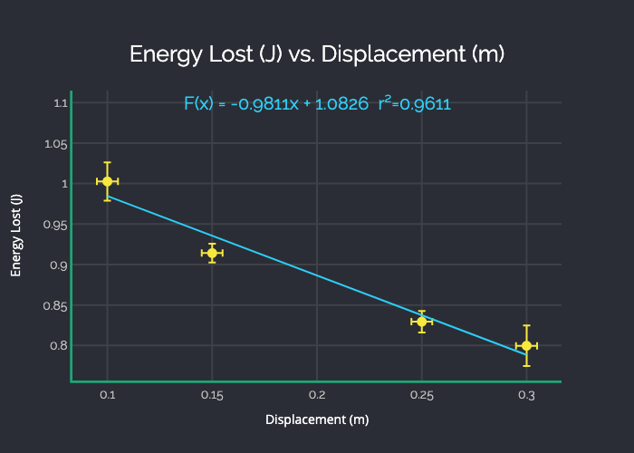

[](https://github.com/DhruvBisla/plably/actions/)
[](https://pypi.org/project/plably/)

# Plably

## Background

### Motivation
I use plably to generate the graphs for my lab reports. It incorporates some extra functionality I could not find in other software, including that of graphing uncertainty.

### Plably??
Alright, I could've been a bit more creative. "Plably" is the combination of the two words ["plotly"](https://github.com/plotly/plotly.py) and "lab," the python library used to generate the graphs and the purpose of the tool, respectively.

## Installation

```shell
pip install plably
```

Plably may be installed with pip using the command given above.

## Usage

```shell
plably <title> <data> <output>
```

Where title is the title, in the form "Dependent Variable vs. Independent Variable," data is the path to the input csv file, and output is the path to write the generated graph to.

The csv file must contain four columns with the following labels: x, x±, y, and y±. The corresponding data points should be listed beneath this header column. An example may be found [here](examples/example.csv).

## Example

Below is a graph created taken from one of my lab reports that was created using plably.

<p align="center">
    
</p>

## Limitations

At the moment, the data can only be fitted to a line. Fitting the data to polynomials of other degrees will be a featured added soon.
